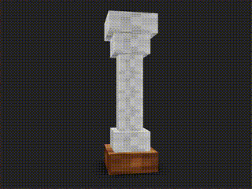

# 🚀 Showing 3D model in React.js



I created a model in Blender and show it in React.js, Used Three.js with three/fiber and deri

### To Run
* Install Project Dependencies
  ```sh
  npm install
  ```
  
* Run Locally
  ```sh
  npm run dev
  ```


